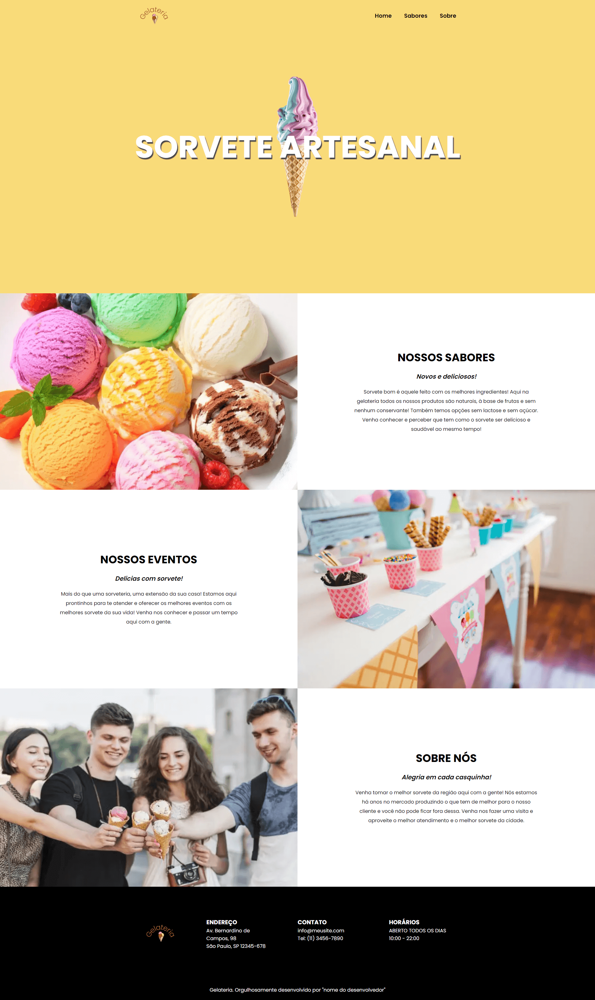

### **Visão geral do projeto**

A proposta desse projeto é criar um site para uma sorveteria em React, para que você coloque em prática os seguintes conceitos:

- Criar SPAs;
- Utilizar o recurso App Router para criar uma aplicação React com múltiplas páginas;
- Implementar a navegação entre páginas em uma aplicação React.

